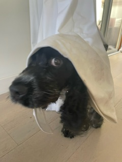

## Why did I include this topic?
I have owned two of these types of dogs, and I currently have a third one named Lili.

## Fun facts about them:
- Royal Connection: They were one of the favorite breeds of Princess Diana!
- Bird Hunters: Originally bred as hunting dogs, they excel at flushing birds, especially woodcock (hence the name "Cocker").
- Wagging Tails: They are known for their constantly wagging tails, especially when they're excited or happy.
- Great Swimmers: With webbed feet, English Cocker Spaniels are natural swimmers and love the water.
- Long Ears for a Reason: Their floppy ears help stir up scents when they are close to the ground, making them excellent trackers.
- Super Friendly: They are known for their cheerful and affectionate personalities, often called "merry cockers."
- Big Appetite: Cocker Spaniels are food lovers and can be prone to overeating, so it's important to watch their diet!

## Photos:

### My dog Lili:

