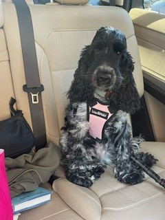

## Why did I include this topic?
I have owned two of these types of dogs, and I currently have a third one named Lili.

## Fun facts about them:
- The longest tennis match in history lasted 11 hours and 5 minutes spread over 3 days.
- Tennis balls were originally white, but they were changed to yellow in 1972 to make them more visible on TV broadcasts.
- The fastest serve in tennis was recorded at 263 km/h (163.7 mph).
- The term "love" in tennis, meaning zero, is thought to come from the French word "l'œuf," meaning "egg," because an egg looks like a zero.

## Photos:

### My dog Lili:

