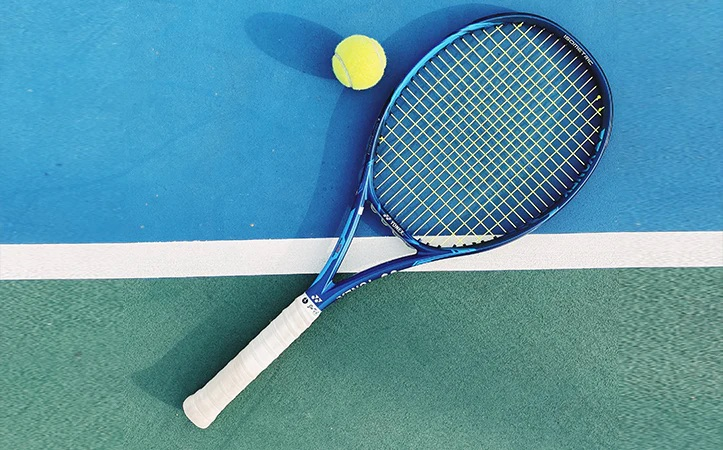

## Why did I include this topic?
I love playing tennis and I'm on the tennis team at Del Norte.

## Fun facts about tennis:
- The longest tennis match in history lasted 11 hours and 5 minutes spread over 3 days.
- Tennis balls were originally white, but they were changed to yellow in 1972 to make them more visible on TV broadcasts.
- The fastest serve in tennis was recorded at 263 km/h (163.7 mph).
- The term "love" in tennis, meaning zero, is thought to come from the French word "l'œuf," meaning "egg," because an egg looks like a zero.

## Links:
- <a href="URL">https://www.tennis4beginners.com/</a>: A site that helps beginners with tips, tutorials, and explanations of basic tennis.
- <a href="URL">https://www.amazon.com/Inner-Game-Tennis-Classic-Performance/dp/0679778314</a>: A book that I reccomend for more advanced players that helps with mental strength.
- <a href="URL">https://www.tennis-warehouse.com/</a>: A popular place to buy tennis rackets, shoes, etc.

