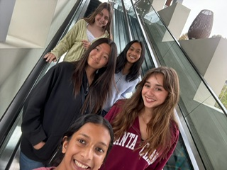
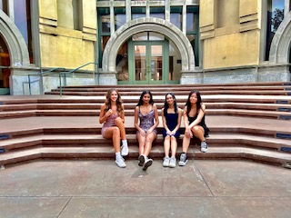
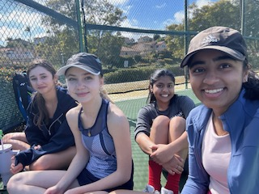

## Hello, I'm Gabriela!

I'm a junior at Del Norte High School. I'm taking CSP to improve my programming skills.

### Fun Facts:
- I live with my parents, a sister, a brother, and a dog
- My birthday is on December 16, 2007
- I play varsity tennis
- My favorite foods are pizza and ice cream
- My hobbies are: reading, drawing, baking, sewing, and traveling
- My dad was born in the US but my mom was born and lived in Brazil

### Photos: 

### Skills & Expertise

- **Programming Languages:** Python, HTML, SQL
- **Other Skills:** AWS

### Get in Touch

- **Slack:** <a href="URL">https://cs-p-hq.slack.com/team/U07HRPRKQHL</a>

- **GitHub:** <a href="URL">https://github.com/gabrielac07</a>
- **Email:** gabic17466@gmail.com

---

*Thanks for visiting!* 😊

