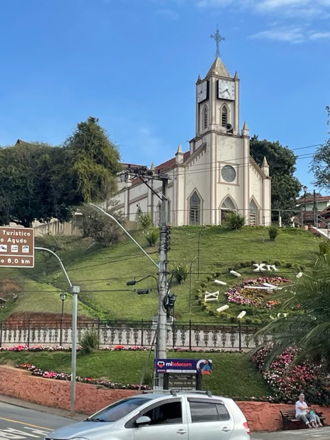
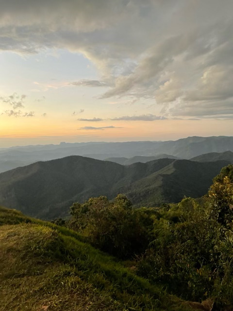
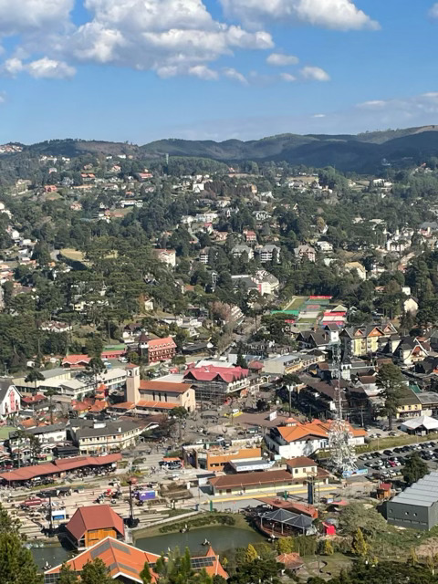
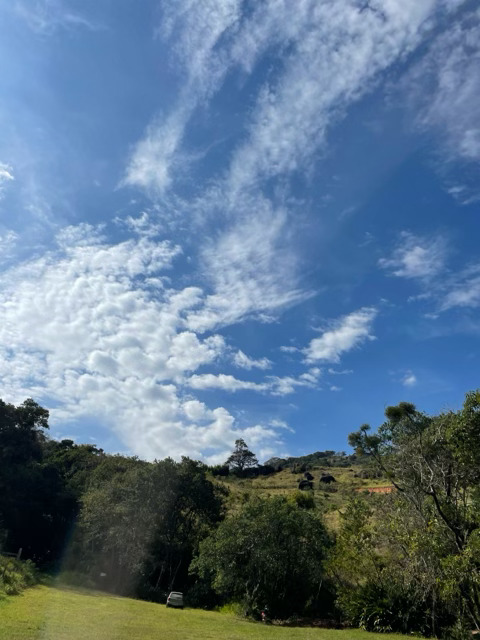
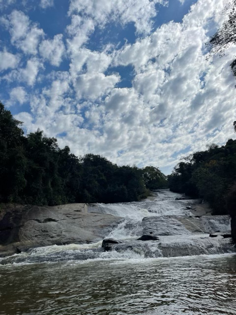
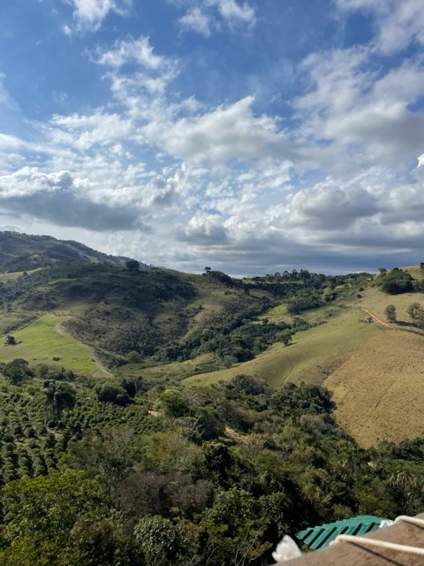
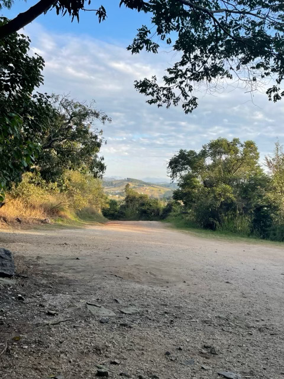
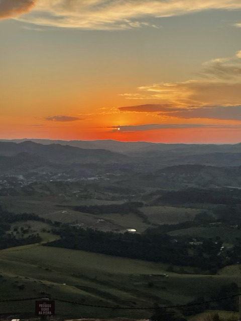

## Why did I include this topic?
My mom's side of the family lives in Brazil, and I've visited there multiple times. 

## Fun facts about Brazil:
- Brazil is the fifth-largest country in the world and largest in South America.
- Brazil is home to 60% of the Amazon Rainforest, the largest tropical rainforest on Earth. 
- Brazil’s Carnival is the largest and most famous festival in the world.
- Brazil is the only Portuguese-speaking country in South America.
- The Brazilian national team has won the FIFA World Cup five times, more than any other country. 
- Feijoada (a black bean and pork stew) is the national dish, but regional specialties range from seafood-based dishes in the northeast to barbecue (churrasco) in the south.
- Brazil is responsible for about a third of the world’s total coffee production.

## Photos:

