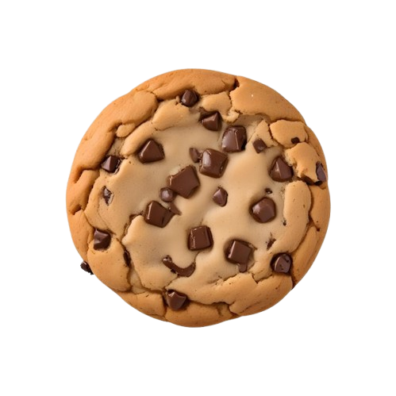

<html lang="en">
<head>
    <meta charset="UTF-8">
    <meta name="viewport" content="width=device-width, initial-scale=1.0">
    <title>Cookie Clicker</title>
    
</head>
<body>
    

        <h1>Cookie Clicker</h1>
        
        <!-- Cookie button -->
        <button id="cookie-button">
            
        </button>
        
        <!-- Display for the cookie count -->
        
Cookies: 0

        <!-- Shop to buy workers -->
        

            <h2>Shop</h2>
            <button id="buy-worker">Buy Worker (Cost: 10 Cookies)</button>
            
Workers: 0

        

    

    <!-- Audio for clicking sound -->
    <audio id="click-sound" preload="auto">
        <source src="../navigation/click-sound.mp3" type="audio/mpeg">
        Your browser does not support the audio element.
    </audio>

    
</body>
</html>
