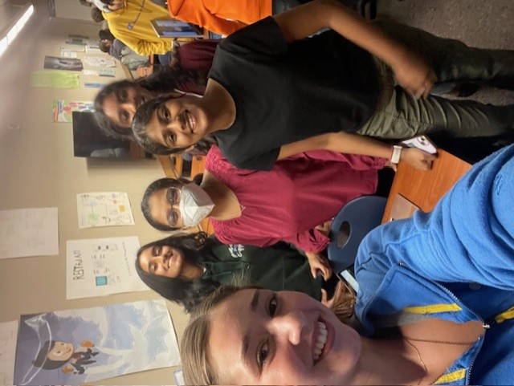
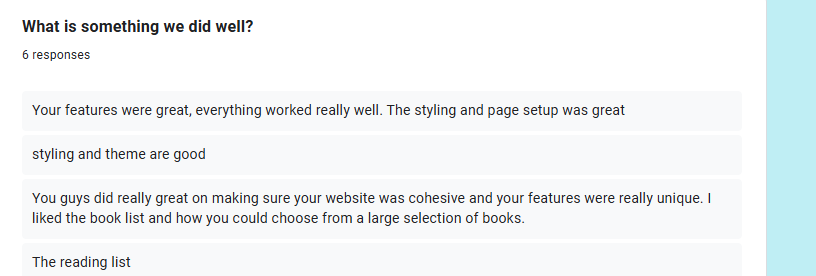
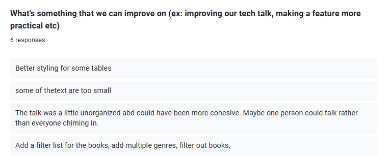
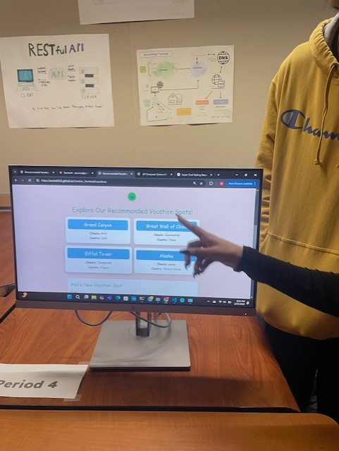
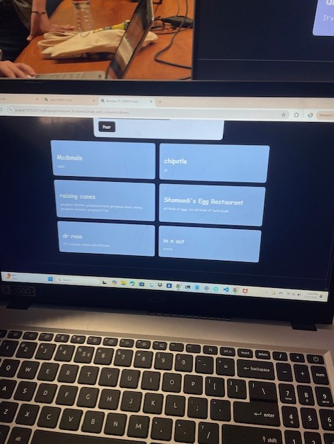
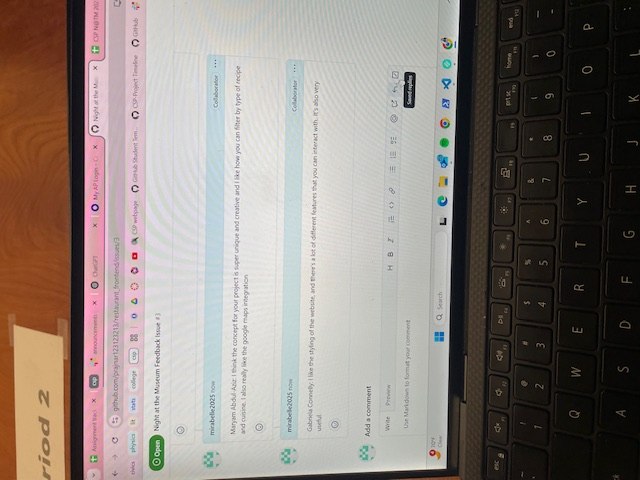
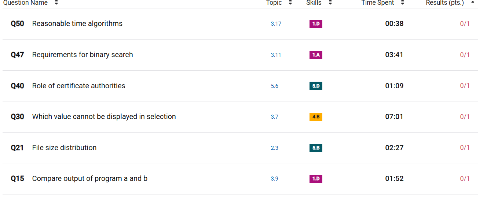
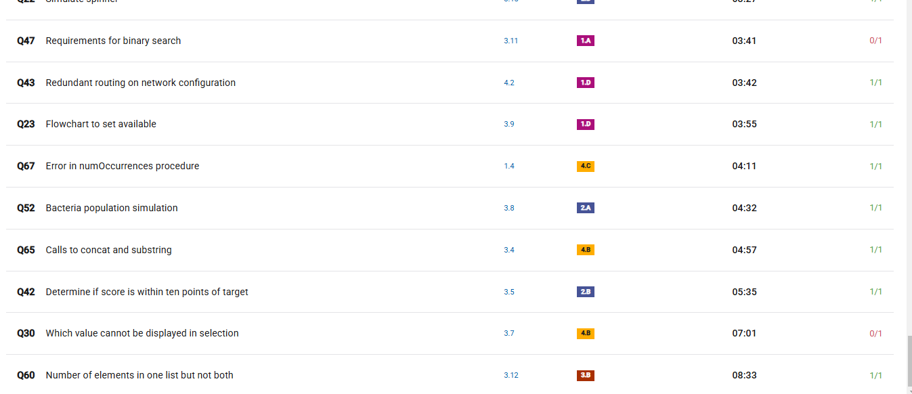

## About My Feature:
The feature that I worked on for the past few weeks is a reading list displayed on the profile. Users are able to add books to their list, and are able to mark each book as you progress through it. They are also able to see the date they added the book, and to check if the book is available to be checked out. You can also delete the book if you don't want it anymore. It gets the books from the main book database, and adds the books to the Wishlist table. It has all the CRUD operations, fulfills all the CB requirements, and API's that function properly on the deployed website.

# 5 things I accomplished over 12 Weeks:
- making a table within a database using Model
- learning how to use token_required and returning a list unique to each user
- using multiple API routes for my feature and testing them on Postman
- learning how to communicate on a team and how to enhance cohesion and unity
- the importance of planning with kanban boards, burn downs, etc.

[Kanban Board](https://github.com/users/gabrielac07/projects/2)
This kanban board helped our group get tasks done and check our progress.

[Burn Down](https://github.com/gabrielac07/bookworms/issues/2) 
This burn down was specific to my feature, and I added to it when I wanted to change something and checked things off when I completed them.

[Figma Board](https://www.figma.com/board/ffwEjQVQMWAX5a4YbyKMuW/Bookworms-planning?node-id=0-1&p=f)
This flowchart is one of our planning documents and it provides a visual so that our group understands how the code is supposed to function.

# N@tM Event + Feedback

At N@TM, I got to share with many students and parents our Bookworms website, and we were able to get some feedback on it. Overall, people agreed that our styling was good and our website was cohesive. The things we can work on are mostly formatting issues and improving our talk.
### Things we did well:

### Things we could improve on:


### Other Projects:
I took an interest in two other CSP projects, including Michelle's group about travel places and Prajna's group about food.

I liked the website about traveling because it's a functional website that can be used in real life, and it had cool features such as recommended vacation spots that are good for travelers.


The project about food and food rating was interesting to me because it can display food from all around the world, and the user can provide their own review of it, similar to Yelp. I was also able to provide feedback on it and interact with their project.



# CPT requirements:

#### Input:
 The user enters the book they would like to read through a dropdown menu, and also edit their progress through the book.

Dropdown list of books:
```html
<label for="bookDropdown">Select a Book: </label>
<select id="bookDropdown">
  <option value="">--Choose a book--</option>
</select>
<button id="addToWishlistButton">Add to reading list</button>
```

Reading status dropdown:
```javascript
const statusDropdown = document.createElement('select');
['for later', 'in progress', 'finished'].forEach((status) => {
  const option = document.createElement('option');
  option.value = status;
  option.textContent = status;
  if (status === book.status) {
    option.selected = true;
  }
  statusDropdown.appendChild(option);
});
statusDropdown.onchange = () => {
  const newStatus = statusDropdown.value;
  const newAvailability = book.availability;
  updateBookInWishlist(book.id, newStatus, newAvailability);
};
```

#### List: 
I use a list of dictionaries to create a list of books that eventually get displayed in the dropdown menu.

```python
    books_list = [{'id': book.id, 'title': book.title, 'author': book.author} for book in books]
```
 #### Sequencing:
 My code uses sequencing because the code executes line by line, importing modules, defining the blueprint, and declaring routes

 ```python
 # Create a Blueprint for the wishlist functionality
wishlist_api = Blueprint('wishlist_api', __name__, url_prefix='/api/wishlist')
```

#### Selection: 
I include if statements that handle conditions, such as JSON requests in the function `add_book_to_wishlist`

```python
if not book_id:
    return jsonify({"error": "Missing book_id"}), 400
```

#### Iteration: 
This is present in `get_user_wishlist` where the code loops over each item and appends it to `books_in_wishlist`

```python
books_in_wishlist = []
for item in wishlist_items:
    book = Book.query.get(item.book_id)
    if book:
        books_in_wishlist.append({
            'id': item.id,
            'book_id': book.id,
            'title': book.title,
            'author': book.author,
            'status': item.status,
            'date_added': item.date_added.strftime('%Y-%m-%d'),
            'availability': item.availability
        })
```
#### Calls to procedure: 
The function `get_wishlist` is called in the `get_user_wishlist` route. It retrieves all the books in their reading list by passing their _uid.

```python
wishlist_items = get_wishlist(current_user._uid)
```

#### Output:
I have conditional output that is based off of selection. It adjusts the JSON output depending on the request:

```python
if wishlist_item:
    return jsonify({"availability": wishlist_item.availability}), 200
else:
    return jsonify({"error": "Book not found in wishlist"}), 404
```

# College Board MC:
#### Score: 61/67
[Download PDF](../images/mc_topics.pdf)

## Questions I got wrong:

## My first MC:

### Topics I had trouble with:
This time was mostly unit 3, but also 2 and 5. This means that I need to focus on:
- 2.3: Extracting Information from Data
- 3.7: Nested Conditionals
- 3.11: Binary Search
- 3.17: Algorithmic Efficiency
- 5.6: Safe Computing

### Questions I missed in both MC's:
- algorithm efficiency and runtime
- comparing code sets and algorithms
### Things that I improved on:
- NAND logic gates
- completing code and using if statements
- citizen science
## Longest Questions:

The types of questions that took me the longest were mostly topic 3, which is algorithms and programming. Most of these took longer because they are more complex and require a lot of thinking, but I need to work on being more efficient with my time. A couple questions I got wrong and they took me a long time, which means I need to review them more. This topic is data selection, which is about constraints and limits of a certain program. 


