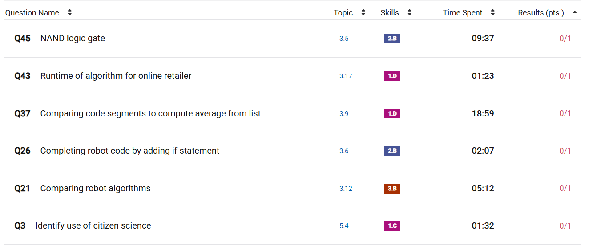

### Score: 54/70

## Questions I got wrong:
1.1 Program function and purpose
1.4 Identifying and Correcting errors
2.4 Using Programs with Data

## My first MC:

### Topics I had trouble with:
This time, it was more scattered, with questions missed from various topics

### Questions I missed in both MC's:
- algorithm efficiency and runtime
- binary search

### Things that I improved on:
- NAND logic gates
- completing code and using if statements
- citizen science

## Longest Questions:
This time, I gave myself the two hours college board allows in order to simulate what it would be like on the test. The maximum time I spent was 4 minutes on strings, and I finished with extra time left over. This means that I need to focus on accuracy rather than speed.

## Quiz Corrections:
###  Consider the two programs below. The figure presents two programs, labeled Program A and Program B, each with two blocks of code that consist of 4 lines. Throughout the second block of code in each program there are nested blocks of code, as follows. 
Which of the following best compares the values displayed by programs A and B?
My answer: Program A and program B display the same number of values, but the values differ.
Correct answer: Program A and program B display identical values in the same order.
Explanation: The two programs aren't in the same order, but they both display the numbers from 1-10. 

###  Which of the following observations is most consistent with the information in the circle graph?
My answer: Over 75% of the files stored are at least 100 KB in size.
Correct answer: Over 75% of the files stored are 10 MB in size or less.
Explanation: The files at least 100 KB are only 59%, while the files up to 10 MB are 76%.

### In the following program, assume that the variable n has been initialized with an integer value. The figure presents 2 blocks of code that consist of 14 total lines. Throughout the code there are nested blocks of code. Which of the following is NOT a possible value displayed by the program?
My answer: too low
Correct answer: out of range
Explanation: Correct. The string "out of range" could only be displayed if the condition n ≥ 1 was false. If the initial value of n is at least 0, then n will be incremented by 1, making n at least 1. Therefore the condition n ≥ 1 will be true and "out of range" will not be displayed. If the initial value of n is negative, then n will be multiplied by -1, making n at least 1. Therefore the condition n ≥ 1 will be true and "out of range" will not be displayed.

### Which of the following best explains how a certificate authority is used in protecting data?
My answer: A certificate authority certifies the safety of a particular Web site so that users know that it does not contain any viruses.
Correct answer: A certificate authority verifies the authenticity of encryption keys used in secured communications.
Explanation: Certificate authorities issue digital certificates that certify the ownership of public keys.

### The procedure BinarySearch (`numList`, `target`) correctly implements a binary search algorithm on the list of numbers `numList`. The procedure returns an index where `target` occurs in `numList`, or -1 if target does not occur in `numList`. Which of the following conditions must be met in order for the procedure to work as intended?
My answer: The list `numList` must not contain any duplicate values
Correct answer: The values in `numList` must be in sorted order.
Explanation: Correct. In order for a binary search on a list to work as intended, the list must be sorted.

###  Consider the following algorithms. Each algorithm operates on a list containing n elements, where n is a very large integer.
1. . An algorithm that accesses each element in the list twice
2. An algorithm that accesses each element in the list n times
3. An algorithm that accesses only the first 10 elements in the list, regardless of the size of the list
### Which of the algorithms run in reasonable time?
My answer: 3 only
Correct answer: 1, 2, and 3
Explanation: for an algorithm to run in reasonable sum, it has to take a number of steps less than or equal to a polynomial function. 1 accesses elements 2n times, 2 accesses n^2 times, and 3 accesses 10 elements.

## Comments

